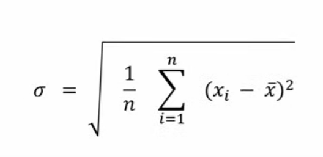

# table of contents 

- [table of contents](#table-of-contents)
- [intro to stats](#intro-to-stats)
- [what are stats](#what-are-stats)
- [descriptive stats](#descriptive-stats)
- [Inferential stats](#inferential-stats)

# intro to stats
im going to bite the bullet and get good at stats because I
want to prove to myself that I can be good at stats too

# what are stats
- deals with the collection analysis and presentation of data
- ex -> we want to see if gender influnces the pefered news paper that somone picks 
- in this case gender and news paper chosen would be our varables that we want to analyize 
- to see if gender has an impact on the perfered news paper we need to gather some data 
- to do this we can get a survay that asks which gender somone is and which news paper they like 
- after getting the answers we can get them in a table 
- our table will have a col that repersents each varable one repersents gender and one repersents the paper they like
- each row will be the response of one person 
- data does not have to come from a survey however, data can also come an experement 
- now that we have the data what do we actually want to know? 
- we didnt survey the entire population we just took a sample should we make our conclusions about the sample or the whole pop?
- to make conclusions about the sample we will use what is called **disctiptive stats**
- to make conclustions about the whole population from a sample this is called **inferental stats**

# descriptive stats 

**why are disctipive stats important**
- we use descriptive stats when we want to know about the sample population 
- lets say a compnay wants to see how its employees get to work 
- we would want to know about how that happens in a survey 
- when we get anough data we can make some conclustions with descriptive stats 

**descriptive stats has 4 key components:** 
- mesures of central tendancy 
- mesures of despersion 
- frequency tables 
- charts

**mesures of central tendancy**
- this is for example the mean, median and mode 
- the mean is the sum of all observations divided by the total amount of observations 
- lets say that we have 5 students taking a test and they all have diffrent scores 
- to find the mean we can add all of the scores up and divide by how many we see 
- the median is the middle value in a data set 
- if the data set has a odd number of data points then the middle number is the median ex -> (1,**3**,5)
- if the data set has an even number of data points then the the median is the mean of the 2 middle numbers
- ex -> (1,2,3,4,5,6) the median would be (3+4)/2 because the number of observations in the dataset is even
- the median is resistent to outliers for ex -> (1,6,500,000,000) even though the lasr value is an extreme outlier
- the median is still 6 however that outlier would affect the mean 
- the mode is the value that appers the most often in a data set if we use the work example 
- if 14 people drive to work then 14 thats the mode idk lol
  
**mesures of despursion**
- this describes how spread out values in a dataset are 
- this includes: 
- varance and standard deviation 
- range 
- and interquartile ranges

**standard devation**
- this is how far away each data point is from the mean on average 
- to calculate SD we use this equation: 

- $\sigma$ repersents our standard devation  
- n is our sample size
- $\bar{x}$ is the mean value of all people 
- xi is the size of each person 

- we have 2 diffrent formulas for SD 

- to keep it simple if our survay does not cover the entire population 
- we always use the second equation the second equation will always estimate the SD
- what is the diffrence between the SD and the varance 
- varance is SD but not square rooted 
  
**range**
- diffrence between max and min 
- the interquartile range is a bit diffrent it represents the middle 50 percent of the data
- its the diffrence between the first quartile Q1 and Q3 so Q1 - Q3
- 25% of the values are higher and 25% of the values are lower in the innterquartile range

**central tendancy vs despersion**
- a mesure of central tencancy will come up with one value that repersents the entire dataset
- central tendancy creates a central data point 
- mesures of dispursion repersents how spread out the data points are
- to sum it up central tencancy gives the center point of the data and dispursion is how spread out that data is around the mean 
  
**tables**
- we have 2 types of tables 
- frequency tables and congingency tables 

**freaquency table**
- a freaquency table tracks how often a value is counted in the dataset 
- ex ->  we can do a survey of people and ask how they get to work then we can make a 
- frequency table which on one col shows the mode of transport and on the other col 
- it shows how many occurances happen 

**Contingency table (crosstab)**
- lets use the work survey example and lets say that there are now 2 offices 
- one in detroit and one in cleveland 
- now we will ask the employees how they get to work and where the work
- we can display both values using a Contingency table

- the rows repersents the catagories of one varable in this case being how many people chose their mode of transport
- the cols repersent how many people that surveyed are from detroit or cleveland 

# Inferential stats 

**what are inferental stats**
- inferental stats allows us to make a conclusion on a population based on data that is given by a sample 

- population is the whole group we are intrested in 
- sample is the group that we study 

**hypothisys**
- we need to state a hypothysis that we want to test
- ex -> if we want to know if a drug will have an affect on people with high blood pressure
- our pop would be people with high blood pressure in the US 
- we cant get data from evreyone so we get a sample size 

**hypothisys testing**
- we use hypothisys testing for testing a claim about a population using data mesured in a sample 
- there are a lot of diffrent types of tests 
- t-Test
- ANOVA
- Chi^2 

**how to do a hypthotsys test**
- when we start with a test we start with a research hypothisys (alternative hypothsys)
- this is the hypothesis we want to find evidence for
- so if we are trying to see if our drug has an effect on blood pressure our research hypothsys would be that the drug does have an affect on blood pressure
- we cant test on this directly with a classical hypothsys test so we test the *opsite*
- so we end up testing if the drug has no effect on blood pressure 
- we are going to test the oppisite and see how our sample performs 

*breaking it down*
- first we are going to assume that the drug has no effect on the population 
- then we are going to sample the drug on some people 
- if we find that people are being affected by the drug we can ask ourselfs how likley is it that we have a bunch of people that are affected by this drug when the drug actually has no effect (basically how likley is it to get a sample like this due to random chance) 
- if we can find a sample like this (and its not random) often then we might have enough evedence to reject the null hyp. meaning that the drug actually has an affect 
- the probibility of finding another sample like our first one or finding another sample that deveates even more is called the *p-value*

*aside*
- our p value explains how likley it is to have a crazy result due to random chance if the null hyp is true 
- this basically means that if the p is low getting a crazy result is not due to random chance 
- and if the p is high then its random af

**statistical significance**
- we want to set a number for our p value to be in order to say that its stastically significant 
- if we get a P less than 0.05 thats usually a good indacatior that our null hypothsys is wrong 
- however a small p value does not prove that the alternative hyp is true
- it only says that its unlikley to get a a crazy value when the null hyp is true 

*aside*
- small p value says that the data is inconsistant with the null hypothsys
- big p value says that the observed data is consistant with the null hyp and we will not reject

**type error**
- type 1 error: happens when a true null hyp is rejected
- ex -> the drug actually had no effect but our sample was so crazy that we thought it actually had an effect
- type 2 error: when a false null hyp is not rejected
- this means that the drug worked but the sample showed no diffrence so we thought it didnt work 

